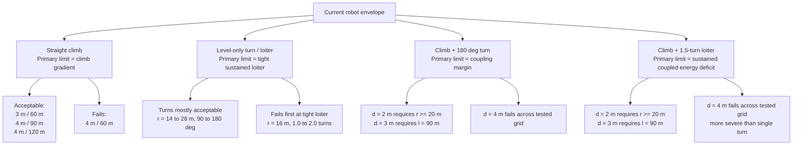

# Flapping robot capability envelope

_DeLaurier + non-RL teacher-only path-mission sweep, recorded on 2026-04-12_

---

## 📋 Scope

- Fixed aerodynamic backend: `DeLaurier`
- Controller chain: non-RL `scripts/flapping_px4/fly_path_mission.py`
- Teacher / PX4-like controller only
- No RL actor contribution

This note records the **current sustainable envelope** of the robot under the present plant and controller stack.

For this memo, a case is treated as **acceptable** only if both conditions hold:

- `completed_path == true`
- `mean_abs_height_error_m < 0.5`

This stricter rule is intentional. The current analyzer script does not yet treat every `terminated` case as an automatic fail, so the final envelope below is based on the raw `summary.json` results.

## 🗂️ Source runs

The raw sweep artifacts live in the capability worktree:

- Straight climb and level-only sweep root:
  - `.worktrees/capability-envelope/docs/analysis/flapping_px4/capability_envelope/20260411_222139`
- Coupled climb + turn sweep root:
  - `.worktrees/capability-envelope/docs/analysis/flapping_px4/capability_envelope_coupled_turn/20260411_224013`
- Coupled climb + loiter sweep root:
  - `.worktrees/capability-envelope/docs/analysis/flapping_px4/capability_envelope_coupled_loiter/20260411_224013`

Derived summaries used during analysis:

- `.worktrees/capability-envelope/docs/analysis/flapping_px4/capability_envelope/20260411_222139/capability_summary_level_turn.csv`
- `.worktrees/capability-envelope/docs/analysis/flapping_px4/capability_envelope_coupled_turn/20260411_224013/capability_summary_turn.csv`
- `.worktrees/capability-envelope/docs/analysis/flapping_px4/capability_envelope_coupled_loiter/20260411_224013/capability_summary_loiter.csv`

## 🧭 Envelope summary

## 📊 Straight climb envelope

Interpretation: in straight flight, the first exposed limit is **climb gradient**, not absolute altitude target.

| Climb delta | Straight length 60 m | Straight length 90 m | Straight length 120 m | Note |
| --- | --- | --- | --- | --- |
| 0 m | Accept | Accept | Accept | Baseline |
| 1 m | Accept | Accept | Accept | Comfortable |
| 2 m | Accept | Accept | Accept | Comfortable |
| 3 m | Accept | Accept | Accept | Nearer to limit at 60 m |
| 4 m | Fail | Accept | Accept | `4 m / 60 m` crosses the height-error threshold |

Representative values:

- `straight_climb_d3_l60`: `mean_abs_height_error_m = 0.186`, `mean_speed_mps = 7.543`
- `straight_climb_d4_l60`: `mean_abs_height_error_m = 0.509`, `mean_speed_mps = 7.231`
- `straight_climb_d4_l90`: `mean_abs_height_error_m = 0.285`, `mean_speed_mps = 7.377`

## 🔄 Level-only envelope

### Pure turn

Sampled range:

- radius `14, 16, 18, 20, 24, 28 m`
- sweep `90, 120, 180 deg`

Result:

- Pure turns are mostly acceptable across the sampled grid.
- Even the tighter `180 deg` turns do not become the first dominant failure mode under the present acceptance rule.

### Pure loiter

Tight sustained loiter is the first level-only boundary:

| Case | Result | Evidence |
| --- | --- | --- |
| `loiter r16, 1.0 turn` | Fail | `mean_abs_height_error_m = 1.194` |
| `loiter r16, 1.5 turns` | Fail | `terminated`, `mean_abs_height_error_m = 1.809` |
| `loiter r16, 2.0 turns` | Fail | `terminated`, `mean_abs_height_error_m = 1.809` |

So for level-only tasks, **longer sustained bank** is worse than a single turning segment.

## 🛫 Coupled climb + 180 deg turn envelope

This is where coupling begins to shrink the usable envelope.

| Climb delta | Straight length | Radius 16 m | Radius 20 m | Radius 24 m |
| --- | --- | --- | --- | --- |
| 2 m | 60 m | Fail | Accept | Accept |
| 2 m | 90 m | Fail | Accept | Accept |
| 3 m | 60 m | Fail | Fail | Fail |
| 3 m | 90 m | Accept | Accept | Accept |
| 4 m | 60 m | Fail | Fail | Fail |
| 4 m | 90 m | Fail | Fail | Fail |

Important nuance:

- `d = 2 m` already fails at `r = 16 m` through **early termination**, even though the mean height error is still modest.
- `d = 4 m` usually still completes for the tested turn cases, but altitude quality is already poor:
  - `r20, d4, l60`: `mean_abs_height_error_m = 1.640`
  - `r24, d4, l90`: `mean_abs_height_error_m = 1.110`

This means the coupled turn boundary degrades in two stages:

1. small-radius combined cases lose completion margin first
2. larger-radius combined cases later lose altitude quality

## 🌀 Coupled climb + 1.5-turn loiter envelope

This is the harshest tested regime.

| Climb delta | Straight length | Radius 16 m | Radius 20 m | Radius 24 m |
| --- | --- | --- | --- | --- |
| 2 m | 60 m | Fail | Accept | Accept |
| 2 m | 90 m | Fail | Accept | Accept |
| 3 m | 60 m | Fail | Fail | Fail |
| 3 m | 90 m | Accept | Accept | Accept |
| 4 m | 60 m | Fail | Fail | Fail |
| 4 m | 90 m | Fail | Fail | Fail |

Representative failures:

- `climb_turn_loiter_r16_n1p5_d3_l60`:
  - `terminated`
  - `mean_abs_height_error_m = 1.759`
- `climb_turn_loiter_r20_n1p5_d4_l90`:
  - `terminated`
  - `mean_abs_height_error_m = 1.832`
- `climb_turn_loiter_r24_n1p5_d4_l60`:
  - `terminated`
  - `mean_abs_height_error_m = 2.248`

The key difference relative to the single-turn coupled case is that the loiter case tends to fail by **persistent coupled energy deficit and eventual termination**, not just degraded altitude quality.

## ✅ Practical boundary

If the goal is to stay inside a conservative, sustainable region on the current robot:

- Straight climb:
  - keep within about `3 m / 60 m`
  - or spread larger climbs over at least `90 m`
- Level-only turn:
  - ordinary single turns are not the main problem
- Level-only loiter:
  - avoid `r = 16 m` for long sustained loiter
- Climb + turn:
  - `d = 2 m` needs about `r >= 20 m`
  - `d = 3 m` needs about `l = 90 m`
  - `d = 4 m` is outside the tested acceptable region
- Climb + loiter:
  - same pattern as above, but stricter in practice
  - `d = 4 m` is clearly outside the tested acceptable region

## ⚠️ Engineering interpretation

The first dominant limitation is **not** pure bank-turn capability by itself.

The current stack fails first when:

- climb gradient is high enough to consume most of the straight-flight energy margin, and
- that climb is immediately followed by sustained bank demand, especially loiter

In other words, the real boundary is the **combined climb-demand + sustained bank-demand envelope**.

That is the main conclusion this memo is meant to preserve.
