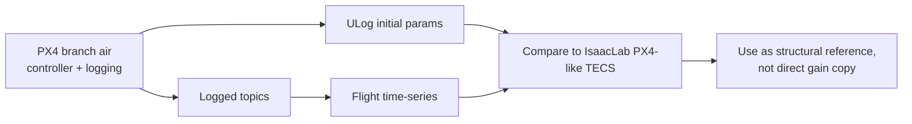

# PX4 Real Flight Reference For Flapping Sim Tuning

Date: 2026-04-11

Scope:
- PX4 repo: `/home/zn/PX4-Autopilot`, branch `air`, HEAD `0542639f57 logger: add flapping dataset logging profile`.
- ULog dirs: `/home/zn/QgcLogs/2026.4.9`, `/home/zn/QgcLogs/2026.4.10`.
- Sim context: IsaacLab DeLaurier flapping robot, non-RL PX4-like controller path.

This file records what can and cannot be transferred from the real PX4 setup into the IsaacLab controller/plant tuning.

## Summary

The real PX4 code/logs are useful as a reference for controller structure, actuator allocation, and operating envelope, but the gains should not be copied directly into sim. The real setup runs a standard-plane PX4 controller with custom flapping-specific logging and airspeed-quality hardening. In successful logs it typically flies with `FW_AIRSPD_TRIM=6 m/s`, measured ground speed around `5-7 m/s`, true airspeed often `7-9 m/s`, flap frequency peaks around `5-5.9 Hz`, and TECS pitch setpoint often reaches about `+15 deg` while throttle/motor output is high but not always saturated.

The strongest actionable reference for the IsaacLab problem is:

- Real PX4 does include bank/load-factor awareness, but mainly through throttle/total-energy compensation and bank-aware minimum airspeed, not direct pitch-side lift demand.
- Real PX4 uses `FW_T_RLL2THR=5.0`; IsaacLab currently uses a much larger `teacher_tecs_roll_throttle_compensation=30.0` because the sim maps throttle to `freq_hz` over a narrow `2-5 Hz` range and the scaling is not equivalent.
- Real logs support keeping reset/trim near an already-moving state: successful flight is not a zero-speed launch condition.
- Short failed logs are mostly `MANUAL`/`STAB`, not `AUTO_MISSION`, so they are weak evidence for path-tracking controller tuning.

## Evidence Flow



## PX4 Code Findings

### Branch and logging profile

The active PX4 branch is `air`, HEAD `0542639f57`. The latest commit adds a flapping dataset logging profile:

- `/home/zn/PX4-Autopilot/src/modules/logger/logged_topics.h:46` defines `SDLogProfileMask`.
- `/home/zn/PX4-Autopilot/src/modules/logger/logged_topics.h:59` adds `FLAPPING_DATASET = 1 << 12`.
- `/home/zn/PX4-Autopilot/src/modules/logger/logged_topics.cpp:383` starts `add_flapping_dataset_topics()`.
- `/home/zn/PX4-Autopilot/src/modules/logger/logged_topics.cpp:385-408` logs high-rate attitude, acceleration, odometry, actuator, flap frequency, encoder, airspeed-quality, wind, GPS, and related topics.

The ULogs use `SDLOG_PROFILE=4097`, meaning default logging plus the flapping dataset profile. That is why these logs contain the key topics we need: `flap_frequency`, `actuator_motors`, `actuator_servos`, `vehicle_attitude`, `vehicle_local_position`, `tecs_status`, `ekf2_airspeed_quality`, and `estimator_aid_src_airspeed`.

### Bank/load-factor handling in real PX4

Real PX4 computes bank load factor and feeds it into TECS:

- `/home/zn/PX4-Autopilot/src/modules/fw_lateral_longitudinal_control/FwLateralLongitudinalControl.cpp:610-612` computes `1 / cos(bank)` from attitude and calls `_tecs.set_load_factor(...)`.
- `/home/zn/PX4-Autopilot/src/modules/fw_lateral_longitudinal_control/FwLateralLongitudinalControl.cpp:92-97` also computes minimum calibrated airspeed using `getLoadFactor()`.
- `/home/zn/PX4-Autopilot/src/modules/fw_lateral_longitudinal_control/FwLateralLongitudinalControl.cpp:103` passes `FW_T_RLL2THR` into `_tecs.set_roll_throttle_compensation(...)`.
- `/home/zn/PX4-Autopilot/src/lib/tecs/TECS.cpp:565-568` applies the load-factor correction to demanded total-energy rate, i.e. throttle/energy side.

This matches the earlier IsaacLab root-cause direction: plain PX4-style load-factor compensation is mainly throttle/energy-side. For the DeLaurier flapping plant, relying only on that was not enough, so the sim-side pitch/load-factor compensation is a justified model-specific extension rather than a direct PX4 clone.

### Real controller parameters from ULog

The inspected 2026-04-09 and 2026-04-10 logs use consistent key parameters:

| Parameter | Real PX4 value | Meaning for sim |
|---|---:|---|
| `SYS_AUTOSTART` | `2100` | Generic Standard Plane airframe base. Actual actuator config is parameterized. |
| `FW_AIRSPD_MIN` | `4.0 m/s` | Real lower speed limit. Sim currently should not blindly use this if DeLaurier lift needs higher speed. |
| `FW_AIRSPD_TRIM` | `6.0 m/s` | Real nominal trim. Sim stable straight flight has recently looked closer to about `8 m/s`. |
| `FW_AIRSPD_MAX` | `12.0 m/s` | Real max airspeed setpoint. |
| `FW_PSP_OFF` | `15 deg` | Real pitch offset/trim reference is large. Compare sign carefully because IsaacLab pitch sign differs. |
| `FW_P_LIM_MIN` | `-5 deg` | Real pitch lower limit. |
| `FW_P_LIM_MAX` | `30 deg` | Real pitch upper limit. |
| `FW_R_LIM` | `35 deg` | Real roll limit. |
| `FW_THR_MIN` | `0.10` | Real throttle lower bound. |
| `FW_THR_TRIM` | `0.74` | Real trim throttle is high. |
| `FW_THR_MAX` | `0.98` | Real throttle upper bound. |
| `FW_THR_SLEW_MAX` | `0.15` | Real throttle slew limiting is conservative. |
| `FW_T_CLMB_MAX` | `1.0 m/s` | Real TECS max climb demand is much slower than the sim nominal `3.0 m/s`. |
| `FW_T_SINK_MIN` | `1.0 m/s` | Real min sink rate. |
| `FW_T_SINK_MAX` | `1.5 m/s` | Real max sink rate. |
| `FW_T_ALT_TC` | `10.0 s` | Real altitude loop is deliberately slow. This should not be copied if sim needs faster height capture. |
| `FW_T_HRATE_FF` | `0.15` | Real height-rate feedforward is modest. |
| `FW_T_RLL2THR` | `5.0` | Real roll-to-throttle compensation exists. Sim has different scaling. |
| `FW_T_SPDWEIGHT` | `0.5` | Real TECS balances height/speed more toward altitude than the old sim setting `0.8`. |
| `FW_T_TAS_TC` | `5.0 s` | Real airspeed error time constant is slow. |
| `FW_T_STE_R_TC` | `0.4 s` | Real total-energy-rate filter time constant. |
| `FW_T_I_GAIN_PIT` | `0.05` | Real TECS pitch integrator is small. |
| `FW_T_THR_INTEG` | `0.005` | Real TECS throttle integrator is very small. |
| `NPFG_PERIOD` | `10.0 s` | Real lateral guidance period. |
| `NPFG_DAMPING` | `0.7` | Real lateral damping. |
| `NAV_LOITER_RAD` | `80 m` | Real loiter radius in these logs is much larger than current small sim loiter. |
| `EKF2_FLAP_F_ON` | `1.0 Hz` | Airspeed-quality gate considers flapping active above this threshold. |
| `EKF2_FLAP_F_OFF` | `0.6 Hz` | Airspeed-quality gate considers flapping inactive below this threshold. |
| `SDLOG_PROFILE` | `4097` | Default plus flapping dataset logging. |

Current relevant IsaacLab values for comparison:

| Sim field | Current value | File |
|---|---:|---|
| `reset_forward_speed_mps` | `8.0` | `source/flapping_bot/flapping_bot/direct/flapping_bot/straight_flight_env.py:128` |
| `min_flap_hz` | `2.0` | `source/flapping_bot/flapping_bot/direct/flapping_bot/straight_flight_env.py:199` |
| `max_flap_hz` | `5.0` | `source/flapping_bot/flapping_bot/direct/flapping_bot/straight_flight_env.py:200` |
| `tail_fixed_horizontal_effectiveness` | `0.5` | `source/flapping_bot/flapping_bot/direct/flapping_bot/straight_flight_env.py:228` |
| `tail_elevon_effectiveness` | `1.2` | `source/flapping_bot/flapping_bot/direct/flapping_bot/straight_flight_env.py:229` |
| `base_body_com_override_x_m` | `-0.10` | `source/flapping_bot/flapping_bot/direct/flapping_bot/straight_flight_env.py:232` |
| `tecs_altitude_capture_time_const_s` | `1.0` | `source/flapping_bot/flapping_bot/px4_like/straight_line_controller.py:78` |
| `load_factor_pitch_compensation_gain` | `0.75` | `source/flapping_bot/flapping_bot/px4_like/straight_line_controller.py:74` |
| `teacher_tecs_roll_throttle_compensation` | `30.0` | `source/flapping_bot/flapping_bot/direct/flapping_bot/path_tracking_env.py:244` |
| `teacher_use_tecs_bank_aware_min_airspeed` | `True` | `source/flapping_bot/flapping_bot/direct/flapping_bot/path_tracking_env.py:255` |

The real `FW_T_ALT_TC=10 s` and `FW_T_CLMB_MAX=1 m/s` explain why real PX4 can look altitude-conservative. They are not proof that the sim should be slow; they are useful as a lower-aggressiveness reference.

## Real Actuator Allocation

The ULog parameter set uses `CA_AIRFRAME=1` and `CA_SV_CS_COUNT=3`.

Active control-surface allocation:

| Surface | PX4 type | Pitch torque | Roll torque | Yaw torque | Interpretation |
|---|---:|---:|---:|---:|---|
| `CA_SV_CS0` | `5` | `+1.0` | `-0.5` | `0.0` | One elevon side. |
| `CA_SV_CS1` | `6` | `+1.0` | `+0.5` | `0.0` | Other elevon side. |
| `CA_SV_CS2` | `4` | `0.0` | `0.0` | `+1.0` | Yaw/rudder surface. |

`CA_SV_CS3` also has yaw-like parameters in the saved parameter set, but `CA_SV_CS_COUNT=3` and ULog `actuator_servos.control[3]` is all `NaN`, so the active real allocation in these logs is three servo channels: left elevon, right elevon, and yaw/rudder.

Observed successful long-log servo usage:

| Log | Servo 0 mean/min/max | Servo 1 mean/min/max | Servo 2 mean/min/max |
|---|---:|---:|---:|
| `2026.4.10/log_12` | `0.03 / -0.77 / 1.00` | `-0.06 / -0.97 / 0.96` | `0.09 / -0.26 / 0.59` |
| `2026.4.10/log_16` | `-0.04 / -1.00 / 0.89` | `0.02 / -1.00 / 1.00` | `0.13 / -0.28 / 0.87` |
| `2026.4.10/log_15` | `-0.01 / -0.50 / 1.00` | `-0.01 / -0.62 / 0.93` | `0.07 / -0.25 / 0.26` |

Implication: real elevons can hit normalized limits in some successful flights. This supports keeping enough elevon authority in sim, but it does not prove the current sim height issue is an elevon-angle hard limit. Recent sim evidence showed the height response was outer-loop conservative rather than elevon-saturated.

## ULog Flight Grouping

I grouped logs by duration, path length, and nav-state content, not by file size alone. This matters because some smaller 2026-04-09 logs are long but were logged with fewer topics.

Successful or success-like logs typically have `AUTO_MISSION` samples and path length around `900-2068 m`. Failure/launch-like logs are short, mostly `MANUAL`/`STAB`, and usually have path length below `200 m`.

Representative logs:

| Log | Duration | Path length | Modes | Mean/max flap freq | Mean/max motor0 | Mean/max TAS | Notes |
|---|---:|---:|---|---:|---:|---:|---|
| `2026.4.10/log_12_12-16-48.ulg` | `288 s` | `2068 m` | `MANUAL`, `AUTO_MISSION`, `STAB` | `3.40 / 5.38 Hz` | `0.64 / 0.92` | `8.0 / 13.9 m/s` | Strong success-like sample. |
| `2026.4.10/log_16_12-48-26.ulg` | `247 s` | `1491 m` | `MANUAL`, `AUTO_MISSION`, `STAB` | `3.49 / 5.88 Hz` | `0.77 / 0.98` | `7.8 / 11.6 m/s` | High-energy success-like sample, near throttle max briefly. |
| `2026.4.10/log_15_12-40-06.ulg` | `327 s` | `1774 m` | `MANUAL`, `AUTO_MISSION`, `STAB` | `2.53 / 5.39 Hz` | `0.68 / 0.87` | `3.9 / 12.0 m/s` | Long sample, includes more low-speed/non-auto time. |
| `2026.4.10/log_3_10-24-52.ulg` | `71 s` | `57 m` | `MANUAL`, `STAB` | `0.44 / 4.83 Hz` | `0.51 / 0.74` | `0.6 / 10.6 m/s` | Failed/short sample, not a good controller-tuning sample for `AUTO_MISSION`. |
| `2026.4.9/log_6_17-10-18.ulg` | `227 s` | `1511 m` | `MANUAL`, `AUTO_MISSION`, `STAB` | `3.51 / 5.18 Hz` | `0.67 / 0.85` | `6.1 / 11.0 m/s` | Smaller file but long success-like sample. |

## TECS Behavior In Real Logs

Representative successful logs:

| Log | TECS pitch setpoint mean/min/max | Pitch at `>=14.9 deg` | Throttle setpoint mean/max | Height-rate setpoint mean/max | Mean filtered TAS vs setpoint |
|---|---:|---:|---:|---:|---:|
| `2026.4.10/log_12` | `9.77 / -7.74 / 15.0 deg` | `10.2%` | `0.63 / 0.91` | `0.10 / 0.42 m/s` | `9.26 / 6.15 m/s` |
| `2026.4.10/log_16` | `12.73 / -0.04 / 15.0 deg` | `35.4%` | `0.81 / 0.98` | `0.50 / 0.83 m/s` | `8.48 / 6.23 m/s` |
| `2026.4.10/log_15` | `8.74 / -3.21 / 15.0 deg` | `14.2%` | `0.70 / 0.87` | `0.35 / 0.81 m/s` | `9.18 / 6.22 m/s` |

Interpretation:

- Real PX4 often asks for a high positive pitch setpoint around the `15 deg` region in successful flights.
- Real throttle/motor output is high, and one sample reaches `0.98`, but successful logs are not uniformly throttle-saturated.
- Real TECS height-rate setpoints are modest, usually below `1 m/s`, consistent with `FW_T_CLMB_MAX=1.0`.
- Real airspeed is frequently above the `6 m/s` nominal setpoint in successful logs. This is a useful clue for sim: the model may need speed reserve during climb and turn recovery.

## What This Means For IsaacLab

1. Use real PX4 as architecture reference, not as a numeric gain source.

Real `FW_T_ALT_TC=10 s` and `FW_T_CLMB_MAX=1 m/s` are much slower than the sim-side recovery goal. Copying them would likely make the IsaacLab straight-line height recovery worse, not better.

2. Keep the sim's bank-aware pitch-side compensation.

Real PX4 does not explicitly add load-factor demand into pitch-side lift demand in the same way. It can rely on conventional fixed-wing speed/lift behavior. The DeLaurier flapping plant previously failed with throttle-only compensation, so the sim-side `load_factor_pitch_compensation_gain` remains justified.

3. Treat `FW_T_RLL2THR=5` as evidence for a throttle path, not as a direct value.

The real value is in TECS energy-rate units. IsaacLab's action maps throttle to `freq_hz` in `[2,5]`, and the plant response is nonlinear. The current sim `teacher_tecs_roll_throttle_compensation=30.0` being larger is plausible, not automatically wrong.

4. The current `reset_forward_speed_mps=8.0` has real-flight support.

Real successful logs fly around `5-7 m/s` ground speed and often `7-9 m/s` true airspeed. Starting sim rollouts already moving is more representative than a low-speed reset. The exact `8.0 m/s` value should remain a sim-trim value, not a copied PX4 `FW_AIRSPD_TRIM`.

5. Failed short logs should not drive path-tracking gain tuning.

Most short 2026-04-10 failed logs have no `AUTO_MISSION` segment and low mean flap frequency. They are more useful for launch/arming/startup analysis than for `level_straight`, `level_turn`, or `level_loiter` controller tuning.

## Recommended Next Use

For the next sim tuning pass, use the real data as bounds and sanity checks:

- Keep `max_flap_hz <= 5.0` for sim2real, while noting the real measured `flap_frequency` can peak above `5 Hz` in logs.
- Do not reduce sim climb authority toward real `FW_T_CLMB_MAX=1.0` until straight height recovery is already acceptable.
- If straight height recovery remains underdamped/too slow without overshoot, tune the sim TECS capture path directly rather than copying real PX4 time constants.
- If turn/loiter still lose height after straight is stable, compare `tecs_load_factor`, `tecs_load_factor_pitch_bias`, `freq_hz`, and `vertical_support_ratio` against bank onset. Real PX4 supports the idea that turn compensation must exist, but the sim plant decides whether it should enter pitch, frequency, or both.

## Commands Used

Key commands:

```bash
git -C /home/zn/PX4-Autopilot branch --show-current
git -C /home/zn/PX4-Autopilot log -1 --oneline --decorate
find /home/zn/QgcLogs/2026.4.9 /home/zn/QgcLogs/2026.4.10 -maxdepth 2 -type f -iname '*.ulg'
ulog_info /home/zn/QgcLogs/2026.4.10/log_15_2026-4-10-12-40-06.ulg
python - <<'PY'
from pyulog import ULog
# Used pyulog to extract params and summarize selected ULog topics.
PY
```

## Residual Uncertainty

- I did not manually label every real flight as success/failure from video or pilot notes. The grouping is based on duration, path length, mode content, and speed/frequency activity.
- ULog `tecs_status.timestamp` did not align cleanly with all high-rate topics in every log, so the report uses aggregate TECS statistics rather than time-aligned event claims.
- Real PX4 signs and pitch offsets differ from IsaacLab's convention. Any future parameter transfer must explicitly convert sign and reference frames before implementation.
