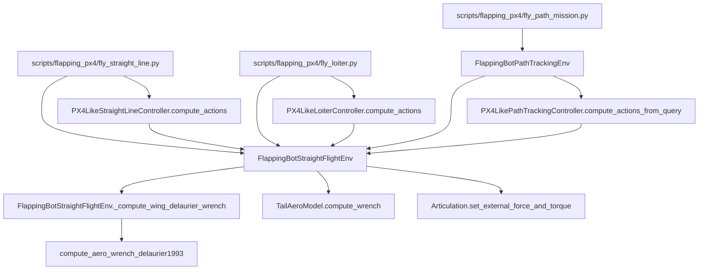
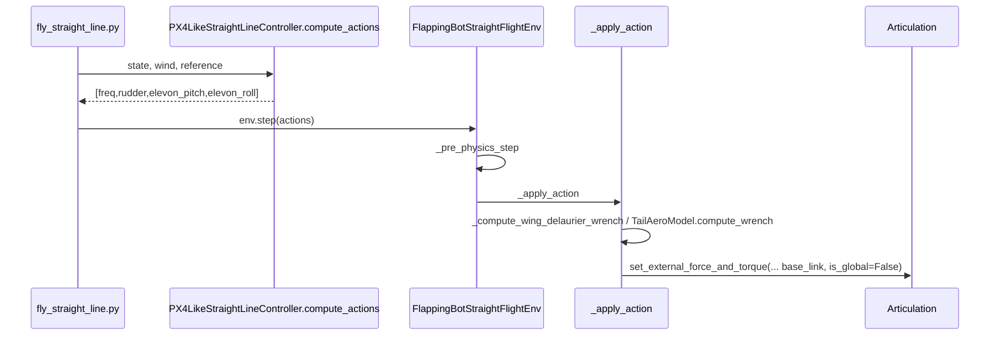
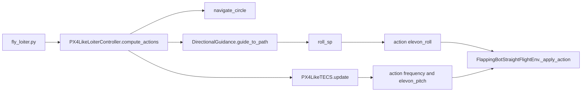
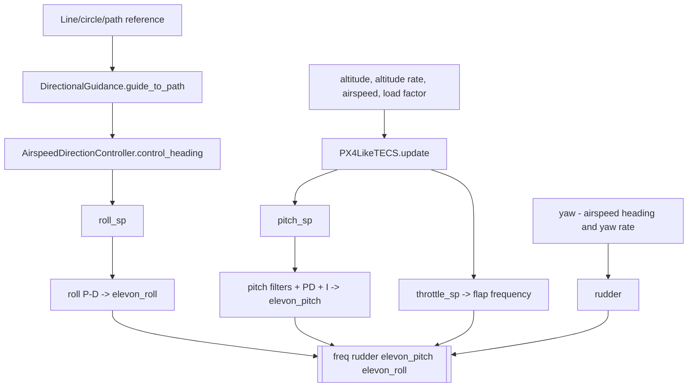

# Current Simulation Call Chain

Date: 2026-07-13. This document describes current code paths, not proposed corrected-model behavior.

## Package-level architecture



`FlappingBotPathTrackingEnv` only extends task reference, teacher, observation/reward/termination logic; it inherits the underlying plant/action/wrench path from `FlappingBotStraightFlightEnv`.

## Straight-flight runtime chain



Evidence: `fly_straight_line.py:443-525,599-706`; `straight_flight_env.py:1090-1317`.

## Loiter runtime chain



Evidence: `fly_loiter.py:510-637,794-804`; `loiter_controller.py:38-296`.

## Path-mission / loiter runtime chain

```mermaid
flowchart LR
  M[fly_path_mission.py] --> PM[PathManager.query]
  PM --> PE[FlappingBotPathTrackingEnv._refresh_path_state]
  PE --> TC[PX4LikePathTrackingController.compute_actions_from_query]
  TC --> GD[DirectionalGuidance and PX4LikeTECS]
  GD --> PA[FlappingBotPathTrackingEnv._pre_physics_step]
  PA --> BA[FlappingBotStraightFlightEnv._pre_physics_step]
  BA --> AP[FlappingBotStraightFlightEnv._apply_action]
  AP --> WX[Articulation.set_external_force_and_torque]
```



The path script intentionally sends dummy policy actions and lets the environment's stateful teacher run once in `env.step` (`fly_path_mission.py:1100-1111`). Generic mission loiter is a `PathManager` primitive; it does not call `PX4LikeLoiterController`.

## Wing-model call chain

```mermaid
flowchart TD
  RS[root_lin_vel_b / root_ang_vel_b / root_quat_w] --> AV[v_air_b = v_b - quat_apply_inverse(quat_w, wind_w)]
  AV --> DW[FlappingBotStraightFlightEnv._compute_wing_delaurier_wrench]
  K[q_cmd qd_cmd qdd_cmd] --> DW
  DW --> SL[compute_delaurier_strip_loads]
  SL --> SI[integrate_delaurier_strip_wrench]
  SI --> ML[Wang to wing-link force and axial-moment mapping]
  ML --> WW[link to world quaternion]
  WW --> RX[translate wing-origin wrench to root_com_pos_w]
  AC[compute_area_weighted_quarter_chord_link_points] --> LG[legacy_fixed_quarter_chord only]
  LG --> RX
  RX --> NB[world to body net force/torque]
```

Default mode is `strip_integrated`; it exposes raw attached-flow strip components and translates each wing wrench from wing-root origin to base COM. `legacy_fixed_quarter_chord` retains the previous aggregate-force closure. Evidence: `straight_flight_env.py:_compute_wing_delaurier_wrench`; `qsm_delaurier1993.py:DeLaurierStripLoads`, `integrate_delaurier_strip_wrench`; `wing_equivalent_ac.py:12-27`.

## Tail-model call chain

```mermaid
flowchart TD
  ACN[_pre_physics_step action mapping] --> MIX[left/right elevon, rudder commands]
  MIX --> TW[TailAeroModel.compute_wrench]
  VB[v_air_b, root_ang_vel_b, base_com_pos_b] --> TW
  TW --> SF[_surface_wrench for five surfaces]
  SF --> LF[v_point = v + omega cross r; projected local flow]
  LF --> FF[lift/drag force_b]
  FF --> TM[cross(r_b, force_b)]
  TM --> SUM[sum tail force and moment]
```

Evidence: `straight_flight_env.py:1152-1184,1254-1278`; `tail_aero.py:423-535`.

## Controller call chain



Evidence: `straight_line_controller.py:344-603`; corresponding loiter/path implementations use circle/path-query geometry.

## External wrench, reset and logging chain

- `_apply_action` sums `f_w_sum + f_tail + f_drag` and `tau_w_sum + tau_tail`, then stores the base-link local wrench (`straight_flight_env.py:1307-1317`). Isaac's API buffers it; `write_data_to_sim` applies it before stepping (`articulation.py:971-1012`).
- Reset sets root state, tail joint states, phase/frequency/action histories, controller state and estimator state (`straight_flight_env.py:1449-1583`).
- Current environment caches net wing/tail force, net wrench and teacher/action diagnostics; scripts serialize selected diagnostics to CSV/JSON. There is no current per-strip or raw-versus-corrected wrench diagnostic contract.

## Inferred relationships

- The diagrams treat `root_lin_vel_b` and the base-link local wrench frame as the project's aerodynamic body frame because the environment uses them that way. No explicit identity assertion between these frames is present.
- The application-point closure is inferred to provide a base-COM-referenced wing torque. The code computes the cross product about `root_com_pos_w`, but documentation does not formally define that field's aerodynamic reference semantics.
