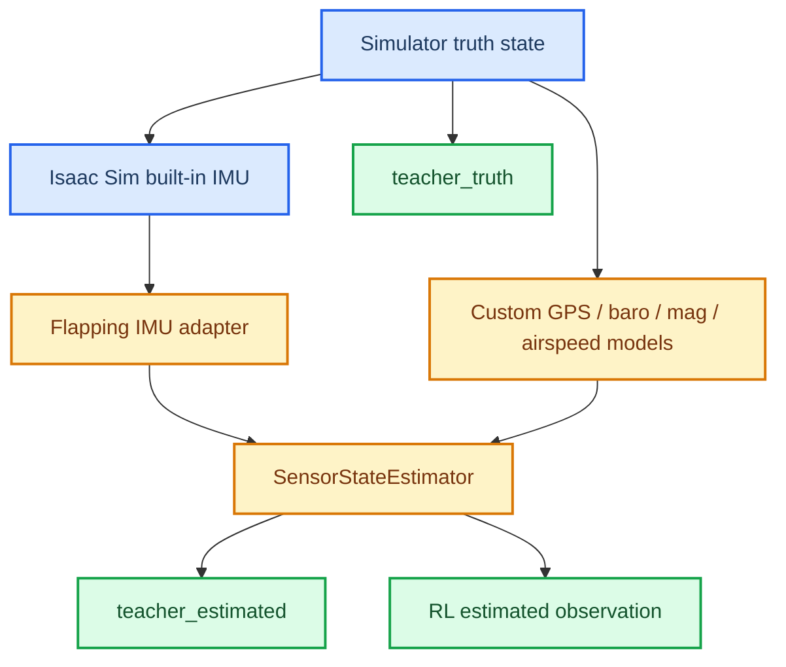

# Isaac Sim IMU Dual-Teacher Design

This design defines the next realism step for the flapping-bot control stack:

1. replace the current synthetic IMU source with an Isaac Sim built-in IMU path, and
2. split the teacher runtime into explicit `teacher_truth` and `teacher_estimated` modes.

It does **not** introduce full PX4 `EKF2` at this stage.

---

## 🎯 Goals

- Keep the current controller-debugging workflow intact.
- Make the teacher capable of running on estimated state, not only truth state.
- Reuse the existing `SensorStateEstimator` instead of building a second estimator stack.
- Upgrade only the highest-value sensor first: IMU.
- Keep the change small enough that straight / loiter teacher regressions remain easy to interpret.

## 🚫 Non-Goals

- No full PX4 `EKF2` port or wrapper in this phase.
- No raw asynchronous sensor packet policy interface in RL.
- No rewrite of `GPS / baro / mag / airspeed` into Isaac Sim-native implementations yet.
- No removal of truth-state teacher mode.

## 🧭 Recommendation

Three approaches were considered:

| Option | Summary | Upside | Downside |
| --- | --- | --- | --- |
| A | Isaac Sim IMU first, keep custom `GPS / baro / mag / airspeed`, dual-mode teacher | Lowest risk, highest signal | Only partial migration to built-in sensors |
| B | Isaac Sim IMU + immediate baro/mag rework, dual-mode teacher | More complete sensor realism | Broader regression surface |
| C | Push toward full PX4 `EKF2` now | Maximum architectural fidelity | Too much scope, harder to debug |

**Chosen option: A.**

Reason:

- The current repo already has a working estimator path in [state_estimation.py](/home/zn/IsaacLab/source/flapping_bot/flapping_bot/px4_like/state_estimation.py).
- The biggest realism gap is not “no EKF2 module name”; it is that some teacher / RL paths still consume privileged truth.
- IMU is the cleanest built-in sensor to migrate first from Isaac Sim.

## 🏗️ Runtime Architecture

## 🧩 Components

### Teacher modes

The controller implementation stays single-source. Only the state input source changes.

- `teacher_truth`
  - consumes simulator truth state
  - used for controller debugging, plant forensics, and non-RL regression
- `teacher_estimated`
  - consumes estimator outputs
  - used for RL, realism evaluation, and future sim2real-aligned checks

This split is important because removing truth-mode would make later debugging ambiguous. If behavior degrades, we need to know whether the fault is:

- controller logic,
- plant dynamics,
- sensor model, or
- estimator logic.

### IMU adapter

The repo should not read Isaac Sim extension code directly from training scripts. Add a small repo-local adapter that:

- initializes one IMU sensor on the robot body,
- reads body-frame angular velocity and acceleration,
- converts outputs into the conventions already expected by `SensorStateEstimator`,
- exposes a stable repo-local interface even if Isaac Sim sensor APIs change later.

Recommended location:

- `source/flapping_bot/flapping_bot/px4_like/isaacsim_imu_adapter.py`

### Estimator contract

The current estimator already provides:

- `pos_local`
- `ground_vel_local`
- `roll / pitch / yaw`
- `ang_vel_body`
- `wind_xy`
- `airspeed`

The change in this phase is the IMU source, not the estimator output contract.

That means:

- keep `SensorStateEstimator` as the only estimator output producer
- add a path for externally supplied `gyro_meas` and `accel_meas`
- retain the current synthetic IMU path as a fallback for tests and A/B comparison

### Sensor boundary

In this phase, use Isaac Sim built-ins only where they are clearly stronger than custom truth-to-sensor code.

Use Isaac Sim built-ins for:

- IMU
- contact sensor when needed later
- camera / lidar / radar when needed later

Keep repo-local models for now:

- GPS
- barometer
- magnetometer
- airspeed / pitot

Reason:

- these four are tightly tied to flight-controller semantics such as update rate, delay, bias, filtering, and wind estimation;
- the current custom implementation already matches the controller interface better than a generic simulator API would.

## 📡 Why not full EKF2 now

Adding a full PX4 `EKF2`-style runtime now would expand the problem too much:

- asynchronous sensor scheduling
- timestamp discipline
- frame-origin semantics
- innovation gating / rejection
- estimator fault handling
- wind and baro fusion tuning

None of those are the immediate blocker.

The immediate blocker is simpler:

- teacher, RL, and evaluation must stop depending on privileged truth when running in realism mode.

So the sequence should be:

1. dual-mode teacher,
2. Isaac Sim IMU integration,
3. unified estimated-state contract,
4. RL on estimated-state,
5. only then consider a closer PX4 `EKF2` emulation if needed.

## 🔬 Verification Strategy

Verification should be staged.

### Stage 1: non-RL script verification

Use:

- `scripts/flapping_px4/fly_straight_line.py`
- `scripts/flapping_px4/fly_loiter.py`

Run three comparisons:

- truth teacher
- estimated teacher with synthetic IMU
- estimated teacher with Isaac Sim IMU

Acceptance:

- no NaNs
- no obvious sign/convention error in roll/pitch response
- straight-flight altitude hold does not collapse
- loiter does not show new heading divergence

### Stage 2: RL env contract verification

Before training, prove:

- actor observation shape is unchanged between truth and estimated modes
- `teacher_estimated` no longer uses truth wind
- `teacher_truth` remains available as a debug baseline

## ⚠️ Risks

### IMU frame/sign mismatch

This is the first likely failure. It can look like:

- roll estimate drifting opposite to truth
- pitch correction fighting the plant
- wind estimate exploding downstream

### Double-filtering

If Isaac Sim IMU already filters internally and the estimator still assumes raw-ish IMU, the total lag can become too large.

### Hidden truth leakage

If the teacher switches to estimated pose but still consumes truth wind or truth yaw elsewhere, the realism contract becomes inconsistent.

## ✅ Decision

Proceed with:

- a repo-local Isaac Sim IMU adapter,
- explicit `teacher_truth` and `teacher_estimated` modes,
- no full `EKF2` in this phase,
- continued use of the existing estimator output contract.

